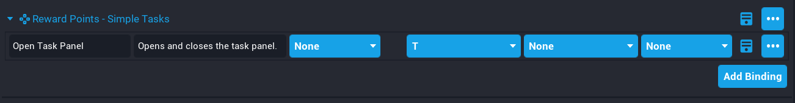

# Bindings

**Simple Tasks** comes with a **Binding Set** so that players can open and close the task panel by pressing **T**. This can easily be changed by opening up the **Bindings Manager** from the **Window** menu.

In the **Binding Manager** panel, look for the binding set called **Reward Points - Simple Tasks**.

!!! warning "If you change the default binding to something other than **T**, then you will need to update the **key_string** settings property so the UI gets updated. See the Settings page."

## Default Core Bindings

It is important to be aware that if you have no default bindings in your **Hierarchy**, then in preview mode, your player will not be able to move. A default binding set comes with new projects, so this should not be be an issue.

A default binding set template is included in the content that can be added to your **Hierarchy** if you prefer not to create one yourself.

