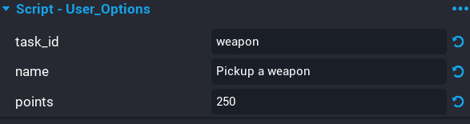

# Creating Tasks

Creating tasks will require you knowing some Lua to be able to setup your own custom tasks. For the most case, it is as simple as adding a broadcast to a script.

In this section, you will learn how to create a simple task that will reward points to players for picking up a weapon.

## Create Task Data Container

A data container needs to be created that holds some information about the task so that it can be dynamically added to the UI Task Panel.

In the **Task** group, duplicate an existing task and rename it to `Reward_Points_Pickup_Weapon`.

The data container has some properties that need to be set.

| Property | Description |
| -------- | ----------- |
| task_id | A unique ID for this task. Try to keep this short, as it will be used in the storage key when saving. |
| name | This is the name that will appear in the task list in the UI, and in the notification. |
| points | The amount of points to reward the player with for completing this task. |

!!! tip "If you want to cut down on storage space used, the task_id can be much shorter if needed. Just keep it unique.



## Create Server Script

You need to detect when the player has equipped the weapon. To do this, you will create a server script and add it as a child of the weapon template. This script would become a child of all weapons in your game, however, it would only run once if the task has been completed.

Create a new script called **Reward_Points_Pickup_Weapon**, and add it to a **Server Context**

### Edit Server Script

Edit the script and add the following code.

```lua
local equipment = script:FindAncestorByType("Equipment")

local evt = nil

evt = equipment.equippedEvent:Connect(function(e, player)
	Events.Broadcast("rpst_event", player, "weapon")

	if(evt ~= nil and evt.isConnected) then
		evt:Disconnect()
	end
end)
```

After the player equips a weapon, the `rpst_event` is broadcasted, which also sends the task id `weapon`. The event for the `equippedEvent` is then disconnected as it is no longer required.

!!! tip "Client Broadcast"
	If there is a task that can only be completed client side (i.e. play an emote), then you can broadcast to the server in the same way the current broadcast works. Make sure to send the player and task ID.