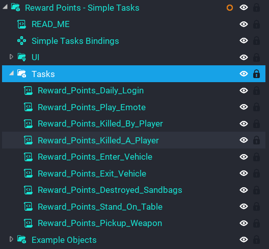
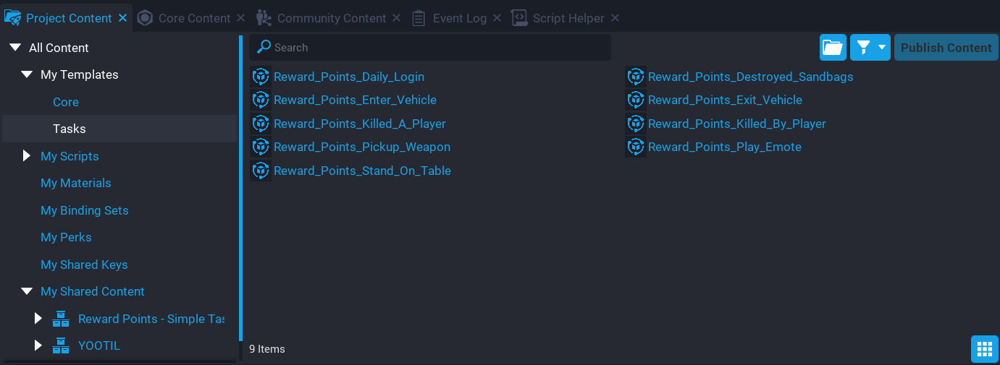

# Default Tasks

**Simple Tasks** comes with some default tasks already setup. These can be removed easily from the task list.

Before you can add or remove tasks, you will need to deinstance the **Reward Points - Simple Tasks** template in your **Hierarchy**.

## Removing a Task

1. Expand the group **Reward Points - Simple Tasks**.
2. Expand the group **Tasks**.
3. Delete any task listed that you wish to remove.

## Adding a Task

1. Expand the group **Reward Points - Simple Tasks**.
2. Expand the group **Tasks**.
3. In **Project Content** under **My Templates**, add a task from the **Task** folder.

