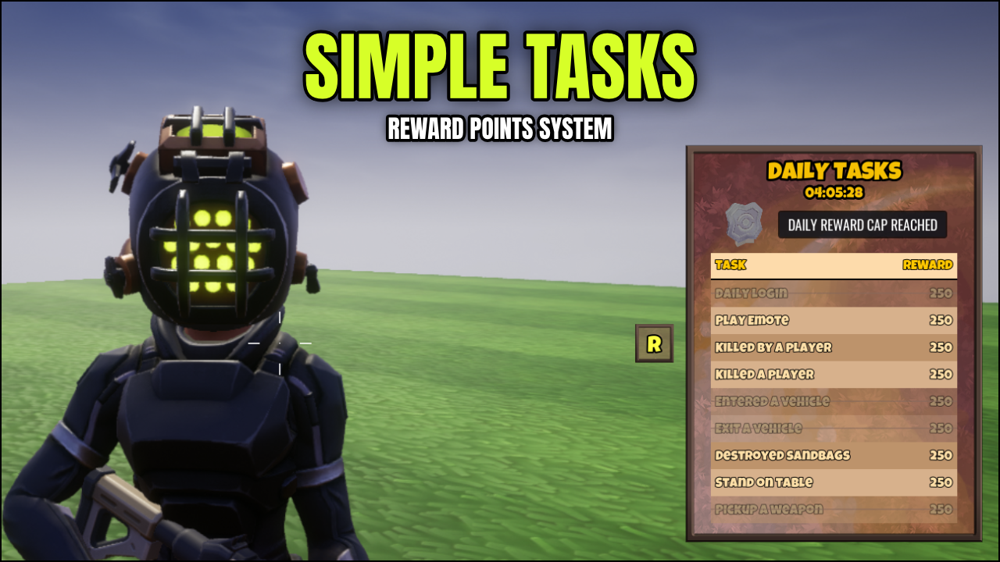

# Simple Tasks Documentation

Welcome to the documentation for **Simple Tasks** found in [Core](https://coregames.com) Community Content.

As a big fan of games that don't require long periods of play to finish daily tasks, I wrote **Simple Tasks**. It is a system used for granting reward points to your players. The system is built around being very simple for players to complete tasks every day, so doesn't support incremental tasks (i.e. get 25 kills).

The system comes with some default tasks that are enabled by default, and few extra examples of how you can use the very simple broadcast API.

<iframe width="560" height="315" src="https://www.youtube.com/embed/jgrxbpfjFlI" title="YouTube video player" frameborder="0" allow="accelerometer; autoplay; clipboard-write; encrypted-media; gyroscope; picture-in-picture" allowfullscreen></iframe>
