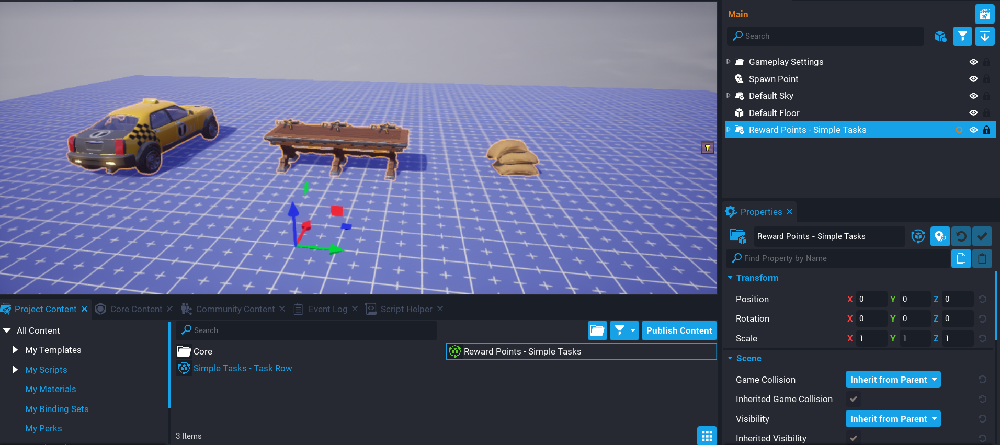

# Quick Start

If you want to just get straight into using the system then follow these steps.

1. Drag template **Reward Points - Simple Tasks** into your **Hierarchy**.
2. Enter preview mode and press **T** to open the task panel up.
3. Complete the tasks.

!!! warning "Player storage will need to be enabled on the Game Settings object."

