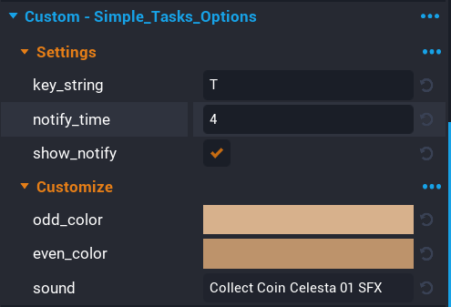

# Settings

**Simple Tasks** comes with some basic settings to customize a few areas of the system. All settings can be found on the root object **Reward Points - Simple Tasks**.

| Setting | Description |
| ------- | ----------- |
| key_string | This is the input key that will be displayed in the UI for opening up the task list. |
| notify_time | This is the amount of time a notification will display for before being tweening out. |
| show_notify | If true, then notifications will be shown to the player. |
| odd_color | The color of the odd row in the task list for a task entry. |
| even_color | The color of the even row in the task list for a task entry. |
| sound | The sound that plays when a notification is shown. |

